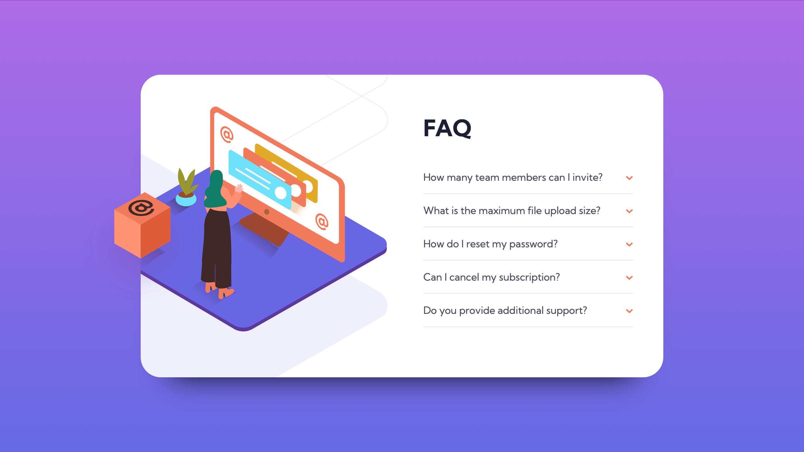

# Frontend Mentor - FAQ accordion card solution

This is a solution to the [FAQ accordion card challenge on Frontend Mentor](https://www.frontendmentor.io/challenges/faq-accordion-card-XlyjD0Oam).

## Table of contents

- [Overview](#overview)
  - [The challenge](#the-challenge)
  - [Screenshot](#screenshot)
  - [Links](#links)
- [My process](#my-process)
  - [Built with](#built-with)
  - [What I learned](#what-i-learned)
  - [Continued development](#continued-development)
  - [Useful resources](#useful-resources)
- [Author](#author)
- [Acknowledgments](#acknowledgments)

## Overview

### The challenge

Users should be able to:

- View the optimal layout for the component depending on their device's screen size
- See hover states for all interactive elements on the page
- Hide/Show the answer to a question when the question is clicked

### Screenshot



### Links

- Live Site URL: [Github live site](https://thermonn.github.io/FAQ-accordion-card/)

## My process

### Built with

- Semantic HTML5 markup
- CSS Grid
- CSS media queries
- Plain ol' JavaScript


### What I learned

```css
@media (max-width: 1150px) {
    #box-image,
    #bg-pattern-desktop,
    #woman-desktop {
        transform: scale(0.90);
    }
    #woman-desktop {
        left: -100px;
    }
    .card {
        grid-template-columns: 400px 1fr;
    }
}
}
```

```js
questions.forEach((question) => 
    question.addEventListener('click', () => {
        question.nextElementSibling.classList.toggle('hidden');
        question.querySelector('.button').classList.toggle('rotate');
        question.classList.toggle('active-bold');
    })
);
}
```

### Continued development

I will figure out how to make my javascript better. In particular, if one question is clicked, any other that is opened needs to be closed. 
Additionally, I will try to get more practice in positioning images, as this was a bit of a nightmare.

### Useful resources

- [W3 Schools CSS Reference](https://www.w3schools.com/cssref/) - Great and consise css tips with examples.
- [Mozilla JavaScript Reference](https://developer.mozilla.org/en-US/docs/Web/JavaScript/Reference) - I never would have known where to start in my JS without some help.

## Author

- Frontend Mentor - [@Thermonn](https://www.frontendmentor.io/profile/Thermonn)

## Acknowledgments

Shoutout to youtube javascript tutorial makers. lol
